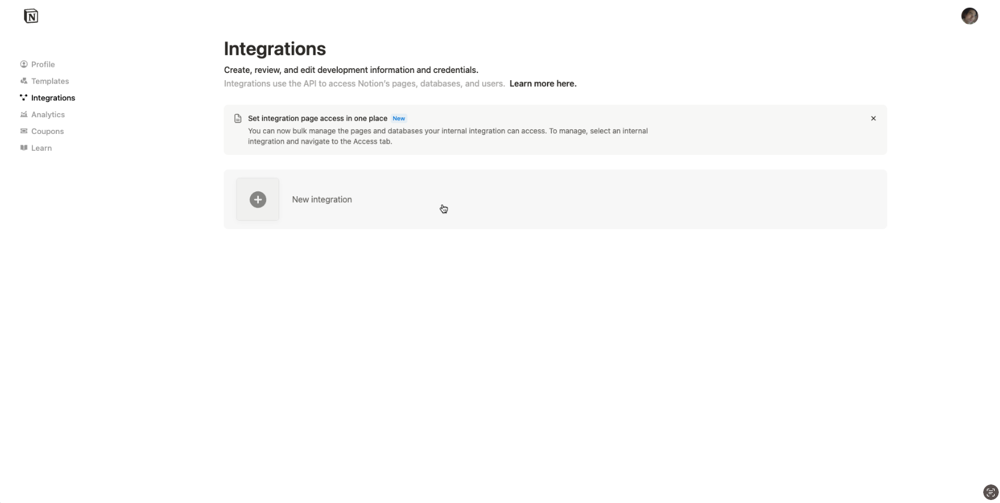
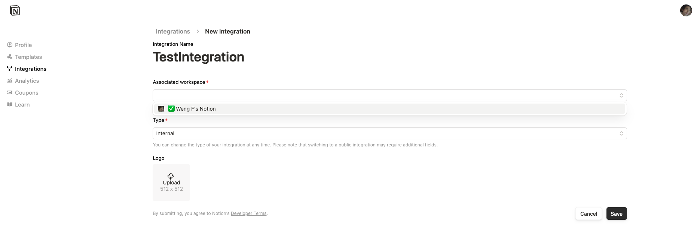
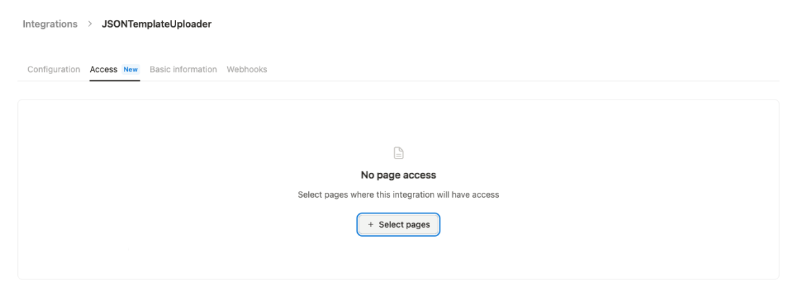
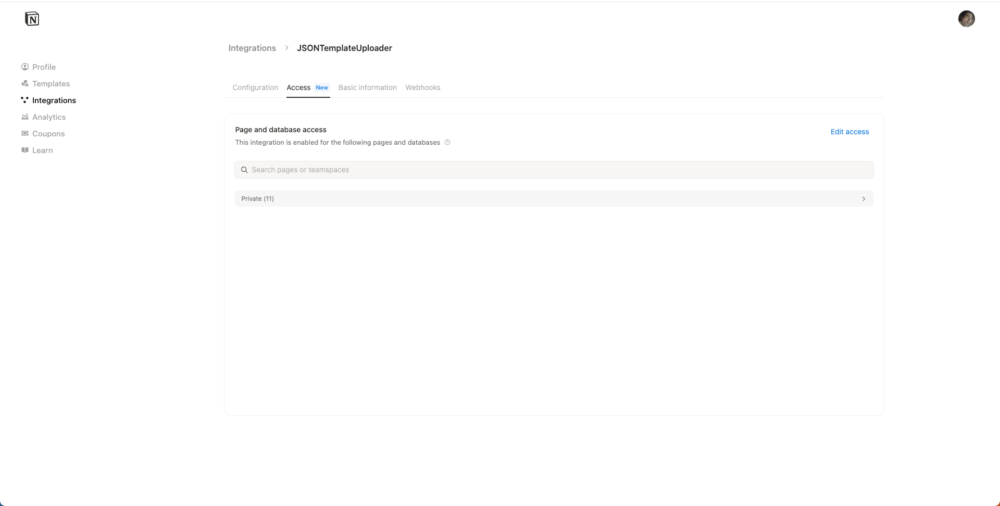
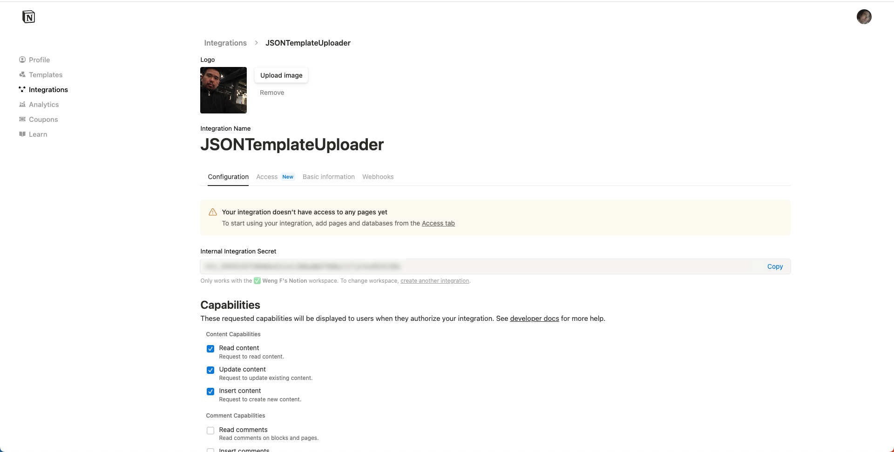
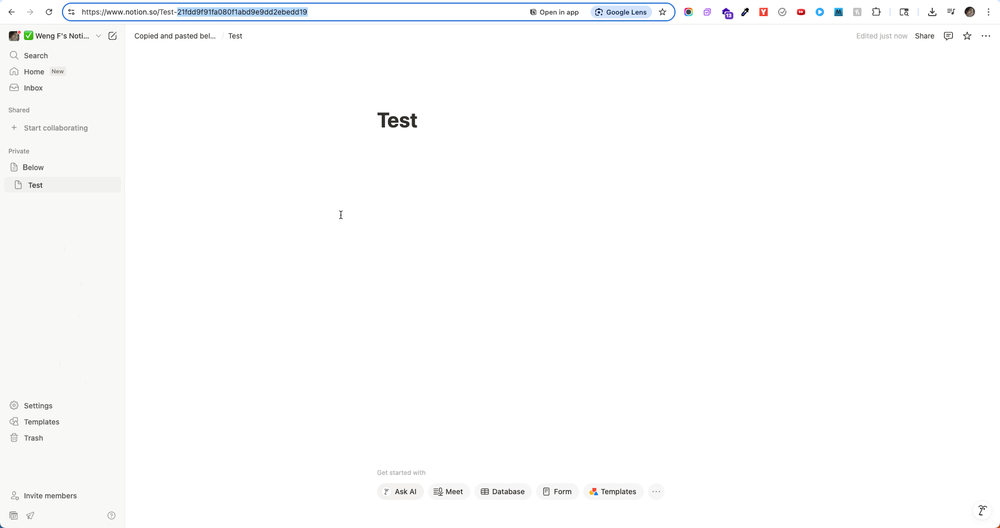
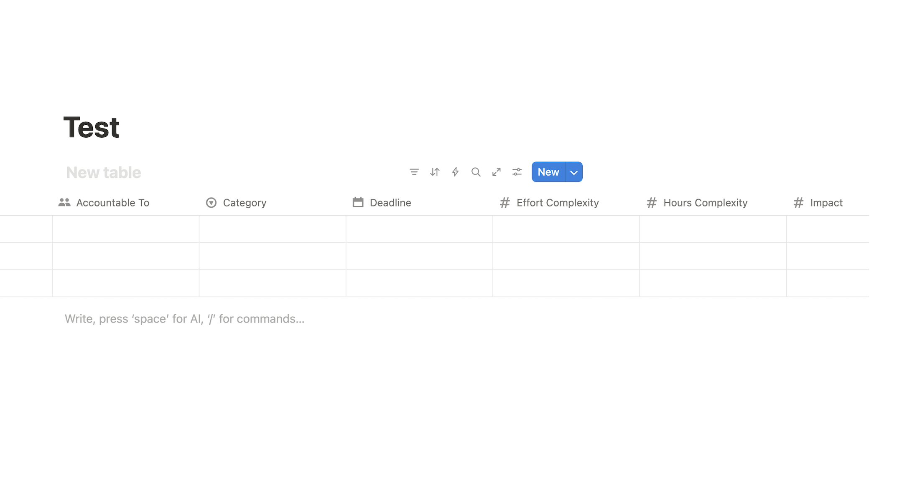

# Notion API - Create Database on Page

By Weng Fei Fung


<a target="_blank" href="https://github.com/Siphon880gh" rel="nofollow"></a>
<a target="_blank" href="https://www.linkedin.com/in/weng-fung/" rel="nofollow"></a>
<a target="_blank" href="https://www.youtube.com/@WayneTeachesCode/" rel="nofollow"></a>

Create Notion databases by generating JSON templates with ChatGPT and uploading them through the Notion API.

## 🎯 How It Works

1. **Ask ChatGPT** to design a Notion database or page for your specific needs.
2. **Request the JSON** template in Notion API JSON format. Feel free to show ChatGPT a truncated example JSON from templates/ folder.
3. **Upload via API** using this tool. Place the json file inside templates/ and make sure .env file points to the json file, your integration ID, and your page ID.

## 🚀 Quick Start

### Prerequisites

- Node.js installed
- A Notion integration token
- A parent page ID where you want to create the database

### Setup

1. **Install dependencies:**
```bash
npm install
```

2. **Set up environment variables:**
Create a `.env` file in the root directory:
```bash
NOTION_TOKEN=your-secret-integration-token
PARENT_PAGE_ID=your-parent-page-id
WORKSPACE_JSON=your-template-file.json
```

3. **Get your Notion credentials:**
   - **Integration Token**: Create a new integration at [https://www.notion.so/my-integrations](https://www.notion.so/my-integrations)


	1. Add an integration
	   
	2. You will name your integration. Do not use the word "Notion" in the name - that's blocked. Select the Notion Workspace that your code will access. Choose Internal or Public purpose. Add your logo.
	   
	3. After your integration is finished creating, go back into editing it. You need to scope the pages at the "Access" tab:
	   
	4. Note that Notion as of June 2025 is glitchy. It may look like the adding page access is unchanged. Just refresh the web browser:
	   

	5. Finally, copy the integration token at the "Configuration" tab:
	   

   - **Parent Page ID**: Copy the page ID from your Notion page URL (the 32-character string after the last `/`). For example, if the page URL in the web app is `https://www.notion.so/Test-21fdd9f91fa080f1abd9e9dd2ebedd19`, then the page ID is `21fdd9f91fa080f1abd9e9dd2ebedd19`.
	   

### Usage

1. **Generate a JSON template with ChatGPT:**

Ask ChatGPT something like:
```
"Create a Notion database JSON template for tracking [your use case]. 
Include properties for [list your requirements]. 

Please provide the JSON in Notion API format that I can upload programatically."
```

2. **Save the JSON template:**
Save ChatGPT's response as a `.json` file (e.g., `my-database.json`)

3. **Decide if you want inline or as a page:**

Inline:


Page:


Page is default. If you want inline, you can add `"is_inline": true` in the JSON file or programmatically add it in the script like was done here:
```
// Set the parent page ID dynamically
payload.parent = {
  "type": "page_id",
  "page_id": PARENT_PAGE_ID
}

// And you would add:
payload.is_inline = true;
```
^ And even better, you could abstract that out into .env file.

4. **Deploy your database:**

```bash
# Using default template
npm run deploy

# Using custom template
WORKSPACE_JSON=my-database.json npm run deploy
```

## 📋 Example Templates

### Task Prioritization Database
The included `notion_task_prioritization_template.json` creates a comprehensive task management system with:
- Task name and categorization
- Impact and complexity scoring
- Time sensitivity and deadlines
- Automated effectiveness formulas
- Vision/mission alignment tracking

### Custom Templates
You can create any type of database by asking ChatGPT for specific JSON templates:

**Example prompts:**
- "Create a Notion database for tracking books I want to read"
- "Design a database for managing client projects with status tracking"
- "Generate a habit tracker database with daily checkboxes"
- "Create a recipe database with ingredients and cooking time"

## 🔧 ChatGPT Integration Guide

### Step-by-Step Process

1. **Describe your needs to ChatGPT:**
```
I need a Notion database for [your purpose]. It should track:
- [Property 1]
- [Property 2]
- [Property 3]

Please create a JSON template in Notion API format that I can upload directly.
```

2. **Request specific property types:**
```
Make sure to include:
- Text fields for [specific fields]
- Number fields for [specific fields]
- Date fields for [specific fields]
- Select/multi-select for [specific fields]
- Checkboxes for [specific fields]
- Formulas for [calculations you want]
```

3. **Ask for the complete JSON:**
```
Please provide the complete JSON payload that I can send to the Notion API 
to create this database, following the official Notion API documentation format.
```

### Tips for Better Results

- Be specific about property types (text, number, date, select, etc.)
- Mention if you want formulas or relationships between properties
- Ask for realistic property names and structures
- Request validation of the JSON format

## 🛠️ Customization

### Modifying Templates
You can edit any JSON template to:
- Add/remove properties
- Change property types
- Modify formulas
- Update select options

### Environment Variables
- `NOTION_TOKEN`: Your integration token
- `PARENT_PAGE_ID`: Where to create the database
- `WORKSPACE_JSON`: Which template file to use (default: `workspace.json`)

## 📖 Notion API Reference

This tool uses the Notion API v2022-06-28. For detailed property types and formatting:
- [Notion API Documentation](https://developers.notion.com/reference/create-a-database)
- [Database Properties Reference](https://developers.notion.com/reference/property-object)

## 🎨 Popular Database Ideas

Ask ChatGPT to create templates for:
- **Productivity**: Task managers, habit trackers, goal setting
- **Content**: Blog post planning, social media calendars
- **Business**: CRM systems, inventory tracking, project management
- **Personal**: Reading lists, travel planning, expense tracking
- **Learning**: Course notes, flashcards, research databases

## 🔒 Security

- Keep your `.env` file secure and never commit it to version control
- Your integration token provides access to your Notion workspace
- Only share templates (JSON files), not your credentials

## 🐛 Troubleshooting

- **401 Unauthorized**: Check your integration token
- **404 Not Found**: Verify your parent page ID
- **400 Bad Request**: Validate your JSON template format
- **403 Forbidden**: Ensure your integration has access to the parent page

## 🤝 Contributing

Feel free to add more template examples in the `templates/` directory or improve the deployment script!
